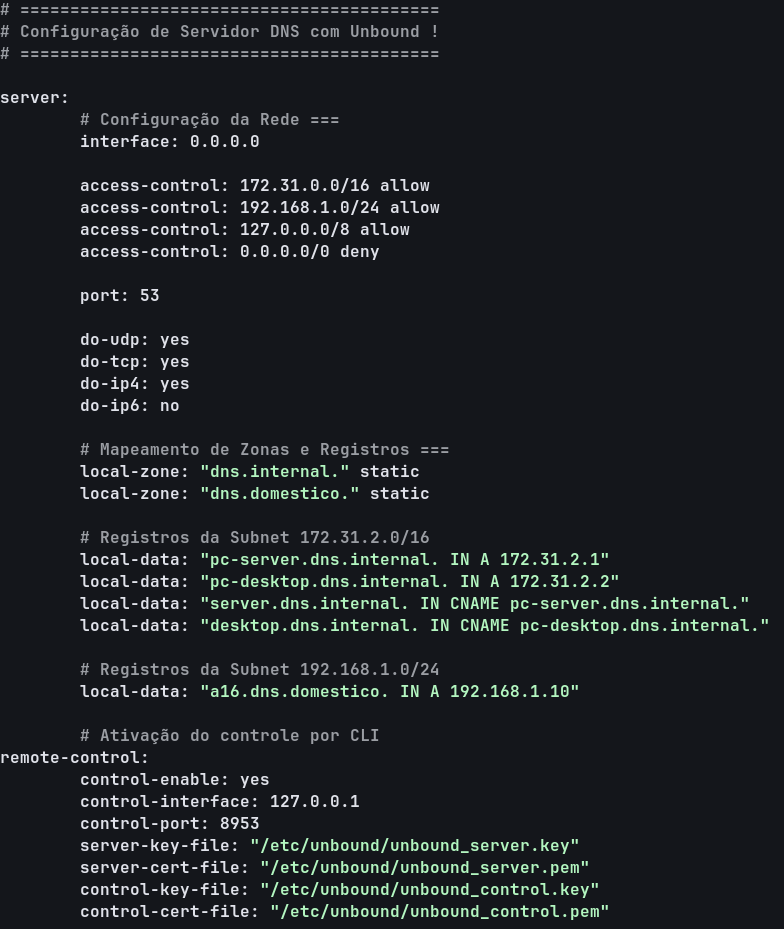

# 🌐 Servidor DNS Autoritativo Local com Unbound

Repositório contendo a configuração otimizada do **Unbound DNS** para resolução de nomes e gerenciamento de rede em um ambiente multi-sub-rede (*dual-homed*), com suporte a controle remoto via CLI, zonas locais estáticas e regras estritas de segurança.

---

## 🛠️ Tecnologias e Ferramentas
* **Linux / Debian / Ubuntu**
* **Unbound DNS Server**
* **unbound-control** (Gerenciamento CLI)

---

## 📐 Topologia e Zonas de Rede
O servidor atende a consultas DNS de duas sub-redes distintas, mapeando registros **A** e aliases **CNAME** personalizados:

* **Sub-rede A:** `172.31.0.0/16` ➔ Zona: `dns.internal.`
* **Sub-rede B:** `192.168.1.0/24` ➔ Zona: `dns.domestico.`
* **Loopback:** `127.0.0.0/8`

---

## ⚙️ Destaques da Configuração (`unbound.conf`)

* **Controle Remoto Habilitado:** Configuração da interface de gerenciamento via `unbound-control` (porta `8953`).
* **Segurança Reforçada:** Regra explícita de negação genérica (`access-control: 0.0.0.0/0 deny`), permitindo acesso apenas para as sub-redes autorizadas.
* **Suporte a Protocolos:** Atuação nas portas DNS padrões via **UDP** e **TCP** (IPv4 ativo e IPv6 desativado).
* **Mapeamento de Zonas Locais:** Resolução estática para hosts locais (`pc-server`, `pc-desktop`, `a16`) e aliases organizados.

---

## 📸 Configuração Final

